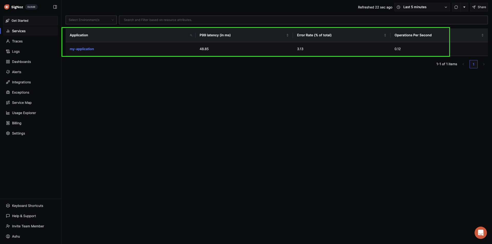

# Lesson 3.1: OpenTelemetry Auto-Instrumentation of Python Application

In the previous tutorial, we set up SigNoz so that we can send the data collected by OpenTelemetry to it.

In this tutorial, we will set up automatic traces, metrics and logs collection in our Flask application with OpenTelemetry. We will make use of auto-instrumentation tools that set up everything for us. With auto-instrumentation, you can configure your Python application to collect telemetry without any changes in the application code.

## Instrumenting Flask application

Getting started with OpenTelemetry is as simple as prefixing your application command with `opentelemetry-instrument`. For example, if you start your application with `python app.py` then run (with your desired settings in place of the example environment variables):

```bash
opentelemetry-instrument python app.py
```

Automatic instrumentation will generate telemetry data for the most common use cases such as HTTP requests, database queries, and other common operations.

## Step 1: Install Distro Package

First, we need to install the _distro_ package with the OTLP exporter. Run the following command to install.

```bash
python -m pip install 'opentelemetry-distro[otlp]'==0.45b0
```

Or alternatively, you can add `opentelemetry-distro[otlp]==0.45b0` to your `requirements.txt` file and run:

```bash
python -m pip install -r requirements.txt
```

This package includes the OpenTelemetry SDK, the OTLP exporter, and the necessary libraries.

## Step 2: Use `opentelemetry-bootstrap` for Auto-Instrumentation

With the distro package installed, we can use the `opentelemetry-bootstrap` tool to automatically install the required instrumentation libraries for our application. This tool inspects the environment and detects the frameworks and libraries installed. 

It then finds and installs the appropriate instrumentation libraries, ensuring comprehensive auto-instrumentation. For example, if you have Flask installed, it will install the `opentelemetry-instrumentation-flask` package (as long as the version is supported).

Run the following command to install the required instrumentation packages:

```bash
opentelemetry-bootstrap --action=install
```

To verify that the required instrumentation packages are installed, run the following command and make sure you see the `opentelemetry-instrumentation-*` for Flask and other libraries:

```bash
python -m pip list | grep "opentelemetry-instrumentation"
```

## Step 3: **Configure OpenTelemetry to Send Data to SigNoz Cloud**

To send data to SigNoz Cloud, set up the environment variables and define the SigNoz Cloud endpoint, region, and authentication headers.

### **Obtain SigNoz Ingestion Key**

Before configuring OpenTelemetry, ensure you have the following information from SigNoz Cloud:

- **Region**: The SigNoz Cloud region you're using.
- **Ingestion Key**: The access token for sending traces to SigNoz Cloud.

You can get it from `Ingestion Settings` under `Settings` as described in the previous article.

### **Environment Variables**

Set environment variables to configure OpenTelemetry to send traces to SigNoz Cloud:

```bash
# Set the service name, SigNoz endpoint, and authentication token
OTEL_RESOURCE_ATTRIBUTES=service.name=<service_name> \
OTEL_EXPORTER_OTLP_ENDPOINT="https://ingest.{region}.signoz.cloud:443" \
OTEL_EXPORTER_OTLP_HEADERS="signoz-access-token=<SIGNOZ_INGESTION_KEY>" \
OTEL_EXPORTER_OTLP_PROTOCOL=grpc \
OTEL_PYTHON_LOGGING_AUTO_INSTRUMENTATION_ENABLED=true
```

Replace **`{region}`** with the SigNoz Cloud region, **`<service_name>`** with the desired name for your service, and **`<SIGNOZ_INGESTION_KEY>`** with your SigNoz Ingestion Key.

### **Run application**

With the correct environment variables, start service with OpenTelemetry instrumentation:

```bash
cd lesson-3-1
OTEL_RESOURCE_ATTRIBUTES=service.name=my-application \
OTEL_EXPORTER_OTLP_ENDPOINT="https://ingest.{region}.signoz.cloud:443" \
OTEL_EXPORTER_OTLP_HEADERS="signoz-access-token=<SIGNOZ_INGESTION_KEY>" \
OTEL_EXPORTER_OTLP_PROTOCOL=grpc \
OTEL_PYTHON_LOGGING_AUTO_INSTRUMENTATION_ENABLED=true \
opentelemetry-instrument python app.py
```

## **Step 4: Test the Application and Generate Trace Data**

Interact with the Flask application to generate tracing data and send it to SigNoz Cloud.

## Step 5: See Trace Data in SigNoz

Once you've created some dummy telemetry by interacting with your application, you will be able to find your application under the `Services` tab of SigNoz.



You can click on the application to see useful application metrics like latency, requests rates, error rates, apdex score, key operations, etc.


## Additional: Troubleshooting if you can’t see data in SigNoz

1. Make sure that the environment variables are set correctly.

2. Verify if the instrumentation is working using the console exporter. Add the following environment variables to export traces to the console. The modified command should look like this:

```bash
OTEL_RESOURCE_ATTRIBUTES=service.name=my-application \
OTEL_EXPORTER_OTLP_ENDPOINT="https://ingest.in.signoz.cloud:443" \
OTEL_EXPORTER_OTLP_HEADERS="signoz-access-token=<SIGNOZ_INGESTION_KEY>" \
OTEL_EXPORTER_OTLP_PROTOCOL=grpc \
OTEL_PYTHON_LOGGING_AUTO_INSTRUMENTATION_ENABLED=true \
OTEL_TRACES_EXPORTER=console \
OTEL_METRICS_EXPORTER=console \
OTEL_LOGS_EXPORTER=console \
opentelemetry-instrument python lesson-3-1/app.py
```

This command will export traces, metrics, and logs to the console. If you don't see data in the console, there might be an issue with the instrumentation. Please check the version compatibility of the instrumentation libraries. However, if you see data in the console, the issue might be with network connectivity or the SigNoz Cloud.

3. Check the logs for any errors or warnings. The logs can provide more information about what's going wrong. If you see errors related to the export, check the network connectivity.

4. If you still can't see data in SigNoz, reach out to the SigNoz support team for assistance.


## Next Steps

In this tutorial, we set up auto-instrumentation for our Flask app with OpenTelemetry. Implementing tracing/metrics/logs with OpenTelemetry is easy as it involves no code changes.

In the [next lesson](https://github.com/SigNoz/opentelemetry-python-example/tree/main/lesson-3-2), we will manually configure the agent to instrument our application.

---
