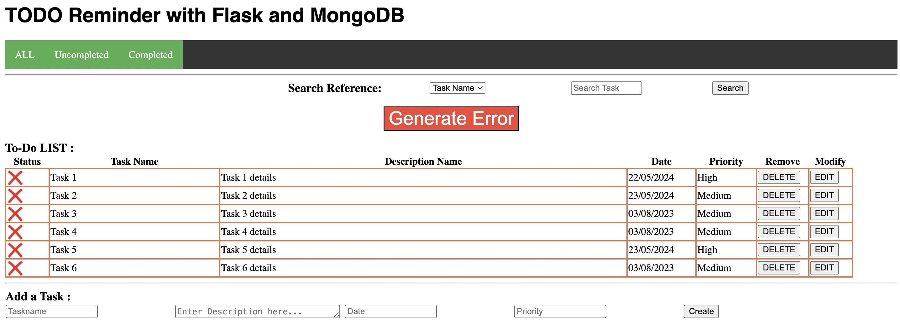
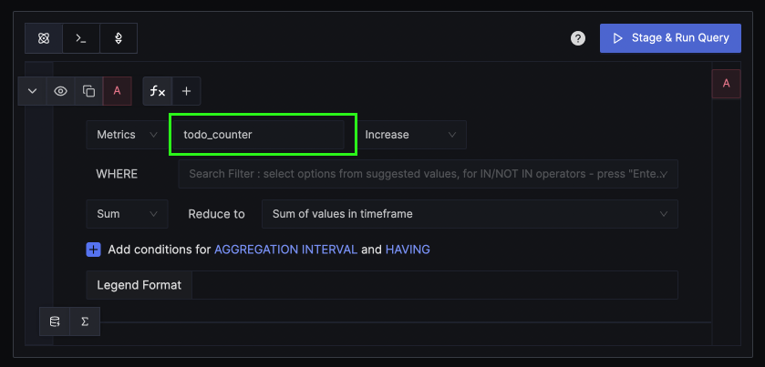
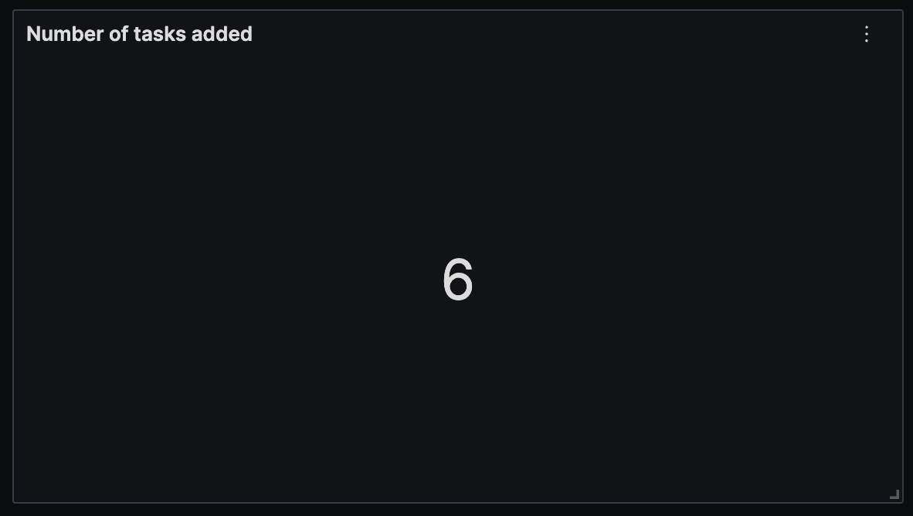
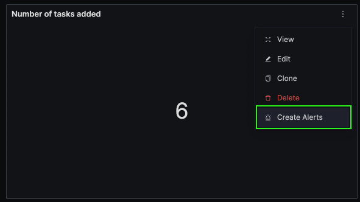

# Lesson 5: Creating custom metrics in Python Application using OpenTelemetry

In the previous tutorials, we have seen how to manually create spans in a Python application. In this tutorial, we will look at how to create custom metrics using OpenTelemetry.

There are four types of metrics that can be produced using OpenTelemetry:

1. **Counter**: A counter is a cumulative metric that represents a single monotonically increasing counter whose value can only increase or be reset to zero on restart. For example, you can use a counter to represent the number of requests served, tasks completed, or errors.

2. **UpDownCounter**: An UpDown counter is a metric that represents a single numerical value that can arbitrarily go up and down. UpDownCounter are typically used for measured values like number of active requests or number of items in a queue.

3. **Histogram**: A histogram samples observations (usually things like request durations or response sizes) and counts them in configurable buckets. It is intended for statistics such as histograms, summaries, and percentile

4. **Gauge**: A gauge is a metric that represents a single numerical value that has non-additive properties. Example, the background noise level - it makes no sense to record the background noise level value from multiple rooms and sum them up.


## Implementing custom metrics in Python application

The manual instrumentation involves using the OpenTelemetry SDK to create metrics. The following code snippets show how to create custom metrics in a Python application.


### Create a Counter

```python
from opentelemetry import metrics

meter = metrics.get_meter(__name__)

counter = meter.create_counter(
    name="tasks_completed",
    unit="1",
    description="The number of tasks completed",
)

counter.add(10)
```

In the above code snippet, we first import the `metrics` module from the `opentelemetry` package. We then create a meter instance using `metrics.get_meter(__name__)`. The `__name__` parameter is used to identify the meter instance. You can create as number _meter_ instances. You might want to have one meter instance for a class, module, or a package.

The `meter` instance is used to create _instruments_. In this case, we create a counter instrument using the `meter.create_counter()` method. The `create_counter()` method creates a counter with the given name, unit, and description. The `unit` parameter is used to specify the unit of the counter. The `description` parameter is used to describe the counter. The `add()` method is used to increment the counter value. It accepts a numeric value to increment the counter by and optionally a set of key-value pairs to set attributes on the counter. The value must always be a non-negative number.

### Create an UpDownCounter

```python
from opentelemetry import metrics

meter = metrics.get_meter(__name__)

up_down_counter = meter.create_up_down_counter(
    name="active_requests",
    unit="1",
    description="The number of active requests",
)

up_down_counter.add(1)
# do some work
up_down_counter.add(-1)
```

The `create_up_down_counter()` method creates an UpDownCounter instrument with the given name, unit, and description. The `add()` method is used to increment or decrement the counter value. It accepts a numeric value to increment or decrement the counter by and optionally a set of key-value pairs to set attributes on the counter. The value can be positive or negative.

### Create a Histogram

```python
from opentelemetry import metrics

meter = metrics.get_meter(__name__)

histogram = meter.create_histogram(
    name="request_duration",
    unit="s",
    description="The duration of requests",
)

histogram.record(0.5)
histogram.record(1.0)
histogram.record(1.1)
histogram.record(5.0)
```

The `create_histogram()` method creates a histogram instrument with the given name, unit, and description. The `record()` method is used to record observations in the histogram. It accepts a numeric value to record and optionally a set of key-value pairs to set attributes on the histogram. The value must always be a non-negative number.

### Create a Gauge

```python
from opentelemetry import metrics

meter = metrics.get_meter(__name__)

gauge = meter.create_gauge(
    name="background_noise_level",
    unit="dB",
    description="The background noise level",
)

gauge.set(60)
```

The `create_gauge()` method creates a gauge instrument with the given name, unit, and description. The `set()` method is used to set the value of the gauge. It accepts a numeric value to set the gauge to and optionally a set of key-value pairs to set attributes on the gauge.

## Step 6: See your metrics in SigNoz

The sample code for lesson 5 has a custom metric named `todo_counter` which keeps a track of number of To-Dos added by the user. You can create customized dashboards to monitor your custom metrics.

In order to see your custom metric in SigNoz, run the updated code with custom metric in Lesson 5.

```bash
OTEL_RESOURCE_ATTRIBUTES=service.name=my-application \
OTEL_EXPORTER_OTLP_ENDPOINT="https://ingest.{region}.signoz.cloud:443" \
OTEL_EXPORTER_OTLP_HEADERS="signoz-access-token=<SIGNOZ_INGESTION_KEY>" \
python lesson-5/app.py
```

Let's suppose you add 6 tasks in your to-do application.



You can go to `Dashboards` in SigNoz and create a new panel to monitor the number of tasks in your to-do application using the `todo_counter` metric.



You can create a value panel type and monitor the number of tasks being created.



You can also set alerts on metrics based on your use-case directly from these panels.




## Next Steps

In this tutorial, we configured the Python application to create custom metrics. Manual instrumentation gives you more granular control on setting up tracing in your Python application.

In the [next lesson](https://github.com/SigNoz/opentelemetry-python-example/tree/main/lesson-6), we will learn how to configure OpenTelemetry logging SDK in Python.
